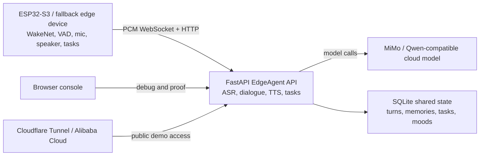

# HomeCue Edge

[](https://github.com/haochase/homecue-edge/actions/workflows/ci.yml)

HomeCue Edge is a privacy-aware home edge agent prototype for context-rich smart home scenarios. It reads local home context, summarizes sensitive data on the edge, plans actions with an OpenAI-compatible LLM (or a deterministic fallback), and executes them through a guarded device simulator. A companion ESP32-S3 firmware turns the same flow into a physical, human-in-the-loop terminal.

## Product Demo

The primary reproducible demo is a software edge-agent loop that keeps planning
separate from execution. It runs without cloud credentials, while preserving
the same local context, action policy, and confirmation boundary used by the
hardware path.

Target demo path:

1. Start the deterministic profile with `scripts/start-software-demo.ps1 -FreshState`.
2. Enable **Agent mode** and **Propose only** in the web console.
3. Run the evening routine to inspect local context, the four-step agent trace,
   and read-only action prechecks.
4. Confirm the pending actions in the web console.
5. Verify the guarded device simulator updates only after confirmation.
6. Switch to **offline** and show the explicit local fallback routine.

The ESP32-S3 terminal is an enhancement path for wake-word input, PCM
WebSocket transport, physical confirmation, TTS playback, and reminder audio.
Its button/serial fallback remains available when voice hardware is not part of
the current demo environment.

EdgeAgent deployment view:



Detailed implementation material:

- [Speaker physical closure runbook](firmware/esp32-audio/SPEAKER-PHYSICAL-CLOSURE-RUNBOOK.md)
- [Voice system architecture](docs/voice-system-architecture.md)

## Core Loop

```text
home context -> local privacy summary -> LLM planning or agent tools -> structured actions -> guarded execution
```

## Project Shape

```text
homecue-edge/
  apps/
    api/              FastAPI edge gateway and device simulator
    web/              React + Vite control console
  firmware/
    esp32-audio/      ESP32-S3-AUDIO-Board human-in-the-loop firmware
  scripts/            Local helper scripts
  .github/workflows/  CI (API tests + web lint/build) and static Pages build
```

## Architecture

- **Edge gateway (`apps/api`)** - FastAPI service exposing `/health`, `/context`, `/devices`, `/plan`, `/execute`, `/voice`, `/devices/reset`. It builds a privacy summary from local context, routes planning by network mode (online / weak / offline) and provider, and guards every device action through a single allow-list policy.
- **Agent tool-calling** - A multi-step planner (`get_home_context`, `get_device_states`, `propose_actions`) produces an auditable `trace`. Actions are pre-checked read-only before any execution.
- **Propose / execute split** - `/plan` with `execute=false` only proposes (with a read-only precheck); `/execute` runs a user-confirmed subset. This enables human-in-the-loop confirmation.
- **Web console (`apps/web`)** - React UI for prompt input, network mode, agent trace, propose-only flow, and a device simulator that polls `/devices`.
- **Firmware (`firmware/esp32-audio`)** - ESP32-S3 terminal: voice/button input proposes a plan, RGB shows state, physical keys confirm or reject before execution.

Voice-system design notes live in `docs/voice-system-architecture.md`; a
concise engineering case study lives in `docs/voice-system-case-study.md`.

## Current EdgeAgent Status

Primary software demo:

- Deterministic local profile with an isolated SQLite database and no cloud
  credential dependency.
- Four-step mock agent trace: context, device state, action precheck, final plan.
- Propose-only planning followed by explicit web confirmation through
  `POST /execute`.
- Online-style local planning plus explicit weak-network/offline fallback.

Hardware enhancement implemented in the repository:

- Wake-word oriented ESP32 firmware path with VAD, WebSocket PCM upload, TTS
  download, speaker playback hooks and due-task polling.
- API routes for voice chat, TTS, memory, tasks, due-task audio and moods.
- SQLite-backed shared state for turns, memories, tasks and moods.
- Browser debug console for voice state, memory, task and mood inspection.
- Ubuntu LAN and tunnel-oriented deployment material.

Open hardware blocker:

- The firmware/TTS path reaches the expected playback log markers, but the
  onboard speaker is not reliably audible in the current hardware setup. Do not
  keep increasing volume. Use the speaker runbook to close the physical path or
  switch to verified audio hardware.

## Provider Configuration

The planner uses an OpenAI-compatible chat completions API. Configure it in `apps/api/.env` (copy from `.env.example`):

- `ACTIVE_PROVIDER` selects the active provider profile.
- Each provider supplies `*_API_KEY`, `*_API_BASE`, `*_MODEL`, `*_PLANNER_PROVIDER`.

Planner modes:

- `mock`: always use the deterministic demo planner.
- `qwen`: require the cloud provider and raise on failure.
- `auto`: use the cloud provider when a key is configured, otherwise fall back to mock.

Offline network mode always uses the local fallback routine. Weak-network mode keeps cached local context and marks the routine as weak-network reasoning.

## Build Journey

Read [Building HomeCue Edge with Qwen Cloud](https://haochase.github.io/homecue-edge/building-homecue-edge-with-qwen-cloud/) for the engineering story behind the Qwen planner, local safety boundary, human confirmation flow, and offline fallback.

## Local Development

Run the API:

```powershell
cd apps/api
python -m venv .venv
.\.venv\Scripts\Activate.ps1
pip install -r requirements.txt
Copy-Item .env.example .env
uvicorn app.main:app --reload --port 8723
```

Run the web console:

```powershell
cd apps/web
npm install
npm run dev
```

Open the Vite URL and keep the API on `http://localhost:8723`. For a public no-backend preview, run the web console with `?demo=static`.

For a deterministic local software demo that never calls a cloud provider and
starts with isolated voice state, keep ports `8723` and `5173` free and run:

```powershell
.\scripts\start-software-demo.ps1 -FreshState
```

This profile uses the local mock planner and a dedicated database under
`.runtime\software-demo`; it does not change the normal development profile.

## Hardware Firmware

`firmware/esp32-audio` targets the Waveshare ESP32-S3-AUDIO-Board (dual mic, ES7210/ES8311, RGB ring, user keys). It connects over Wi-Fi to the gateway, proposes a plan via `/plan` (`execute=false`), and confirms or rejects through physical keys via `/execute`. See `firmware/esp32-audio/README.md` for the full flashing and setup guide. Wi-Fi credentials and the PC address go in a git-ignored `secrets.h` (copy from `secrets.h.example`).

## Local Check

```powershell
.\scripts\check-local.ps1
```

This runs API dependency install, Python compile, API tests, and web lint/build. GitHub Actions runs the same API tests and web lint/build on pushes and pull requests via `.github/workflows/ci.yml`.

## Contributing & Security

This repository is public and holds technical content only. Before committing,
run the privacy/secret scanner:

```powershell
pwsh ./scripts/scan-secrets.ps1            # scan all tracked files
pwsh ./scripts/scan-secrets.ps1 -Staged    # scan staged changes (pre-commit)
```

See [`CONTRIBUTING.md`](CONTRIBUTING.md) for the full pre-commit flow and how to
install the git hook, and [`AGENTS.md`](AGENTS.md) for the rules that apply to
human contributors and AI coding agents.

## License

MIT License. See `LICENSE`.
